# ghOSt: Fast &amp; Flexible User-Space Delegation of Linux Scheduling

原README：[README.md](./RAW_READEME.md)

# ghOSt 的复现

**ghOSt 的实现：**

[44] ghOSt kernel code. https://github.com/google/ghost-kernel

[45] ghOSt userspace code. https://github.com/google/ghost-userspace

### （一）google/ghost-kernel /README.md

ghOSt是在Linux内核之上实现的调度策略的通用委托。ghOSt框架提供了一个丰富的API，用于从用户空间接收流程的调度决策，并将其作为事务来执行。程序员可以使用任何语言或工具来开发策略，这些策略可以在不重启机器的情况下进行升级。ghOSt支持一系列调度目标的策略，从µs级的延迟，到吞吐量，到能源效率等等，并为调度操作带来低开销。许多策略只是几百行代码。总的来说，ghOSt为将线程调度策略委托给用户空间进程提供了一个性能框架，从而实现了策略优化、无中断升级和故障隔离。

为了使用ghOSt用户空间组件，您必须编译并安装这个内核。

这个内核是Linux 5.11。我们建议安装Ubuntu 20.04 LTS作为发行版，它默认随Linux 5.4一起发布。在Ubuntu 20.04上编译这个内核，然后用这个内核替换现有的5.4内核。

这不是官方支持的谷歌产品。

### （二）google/ghost-userspace/README.md

编译好ghOSt内核后。您必须在ghOSt内核上编译和运行用户空间组件。

这不是官方支持的谷歌产品。

#### 编译

ghOSt用户空间组件可以在Ubuntu 20.04或更新版本上编译。

1.我们使用谷歌Bazel构建系统来编译ghOSt的用户空间组件。请参阅Bazel安装指南，以获得在操作系统上安装Bazel的说明。（Bazel是一个构建和测试软件的工具。）

2.安装ghOSt依赖项:

```
sudo apt update
sudo apt install libnuma-dev libcap-dev libelf-dev libbfd-dev gcc clang-12 llvm zlib1g-dev python-is-python3
```

注意，ghOSt需要GCC 9或更新版本，Clang 12或更新版本。

3.编译ghOSt用户空间组件。从存储库的根目录运行以下命令:

```
bazel build -c opt ...
```

`-c opt`告诉Bazel构建目标，优化打开。 `...`告诉Bazel构建`BUILD`文件中的所有目标和子目录中的所有`BUILD`文件，**包括核心ghOSt库、eBPF代码、调度程序、单元测试、实验和运行实验的脚本，以及这些目标的所有依赖项。**如果您更喜欢构建单个目标而不是所有目标来节省编译时间，请替换`…`使用单独的目标名称，例如`agent_shinjuku`。

#### ghOSt项目布局图

- `bpf/user/`
  - ghOSt包含一套BPF工具来协助调试和性能优化。这些工具的用户空间组件都在这个目录中。
- `experiments/`
  - RocksDB和拮抗antagonist实验(来自我们的SOSP论文)和微基准测试。使用`experiments/scripts/` 中的Python脚本来运行Shinjuku实验。
- `kernel/`
  - 具有内核和用户空间使用的共享数据结构的头文件。
- `lib/`
  - 核心的ghOSt用户空间库。
- `schedulers/`
  - ghOSt调度器。这些调度程序包括:
    - `biff/`, Biff (最简单的FIFO调度器，用BPF代码调度一切)
    - `cfs/` CFS (Linux完全公平调度策略的ghOSt实现)
    - `edf/`, EDF (最早的截止日期)
    - `fifo/centralized/`, 集中的先进先出
    - `fifo/per_cpu/`, 每个cpu的先进先出
    - `shinjuku/`, Shinjuku
    - `sol/`, Speed-of-Light (最简单的集中式FIFO调度程序，尽可能快地运行)
- `shared/`
  - 类，以支持调度程序和另一个应用程序之间的共享内存通信。通常，这种通信对于应用程序向调度器发送调度提示非常有用。
- `tests/`
  - ghOSt单元测试。
- `third_party/`
  - `bpf/`
    - 包含我们的BPF工具套件的内核BPF代码(上面提到过)。这个内核BPF代码是在GPLv2下授权的，所以我们必须将它保存在`third_party/`中。
  - `third_party/`的其余部分包含来自第三方开发人员的代码和用于编译代码的`BUILD`文件。
- `util/`
  - ghOSt的辅助实用程序。例如，`pushtoscheed`可用于将一批内核线程从ghOSt调度类移动到`CFS (SCHED_OTHER)`。

#### 运行ghOSt测试

我们包含了许多不同的测试，以确保ghOSt用户空间代码和ghOSt内核代码都能正确工作。其中一些测试在`tests/`中，而另一些在其他子目录中。要查看所有测试，请运行:

```
bazel query 'tests(//...)'
```

要构建一个测试，例如`agent_test`，运行:

```
bazel build -c opt agent_test
```

要运行测试，直接启动测试二进制文件:

```
bazel-bin/agent_test
```

通常，Bazel鼓励在运行测试时使用`bazel test`。但是，`bazel test`沙箱测试，使它们对`/sys`具有只读访问权限，并限制它们可以运行多长时间。但是，测试需要对`/sys/fs/ghost`进行写访问以与内核协调，并且可能需要很长时间才能完成。因此，为了避免沙箱，可以直接启动测试二进制文件(例如，`bazel-bin/agent_test`)，以上代码就是这么实现的。

#### 运行ghOSt调度器

我们将运行每cpu FIFO ghOSt调度程序，并使用它来调度Linux pthread。

1. 构建每cpu FIFO调度程序:

```
bazel build -c opt fifo_per_cpu_agent
```

2. 构建`simple_exp`，它会启动在ghOSt中运行的一系列pthread。`Simple_exp`是一个测试的集合。

```
bazel build -c opt simple_exp
```

3. 启动每cpu FIFO ghOSt调度器:

```
bazel-bin/fifo_per_cpu_agent --ghost_cpus 0-1
```

调度器在cpu(即逻辑内核)0和1上启动ghOSt代理，因此将ghOSt任务调度到cpu 0和1上。根据需要调整`——ghost_cpus`命令行参数值。例如，如果你有一台8核机器，你希望在所有核上调度ghOSt任务，那么将`0-7`传递给`——ghost_cpus`。

4. 启动`simple_exp`:

```
bazel-bin/simple_exp
```

`Simple_exp`将启动pthread。这些pthread将依次移动到ghOSt调度类中，从而由ghOSt调度程序调度。当`simple_exp`运行完所有测试后，它将退出。

5. 使用`Ctrl-C`向`fifo_per_cpu_agent`发送`SIGINT`信号以使其停止。

#### Enclaves，重新启动升级，和处理调度程序失败

ghOSt使用enclave对代理和它们正在调度的线程进行分组。一个enclave包含机器中cpu(即逻辑内核)的子集、包含这些cpu的代理以及ghOSt调度类中的线程(enclave代理可以将这些线程调度到enclave cpu上)。例如，在上面的`fifo_per_cpu_agent`示例中，创建了一个包含cpu 0和1的enclave，尽管可以将enclave配置为包含机器中cpu的任何子集，甚至所有cpu。在上面的`fifo_per_cpu_agent`示例中，当`simple_exp`进程启动时，两个每个cpu的FIFO代理与`simple_exp`线程一起进入enclave。

enclave提供了一种简单的方法来对机器进行分区，以支持策略和租户的共存，这是一个特别重要的特性，因为机器可以横向扩展以包含数百个cpu和新的加速器。因此，可以使用不相连的cpu集构建多个enclave。

**可用升级：**

ghOSt支持调度策略的无重启升级，使用一个enclave封装正在升级的策略的当前线程和CPU状态。当您想要升级策略时，您启动的新进程中的代理将尝试附加到现有的enclave，等待在enclave中运行的旧代理退出。一旦老代理退出，新代理接管enclave并开始调度。

**处理调度程序故障：**

ghOSt还可以从调度器故障中恢复(例如，崩溃、故障等)，而不会触发内核恐慌或机器重新启动。要从调度器失败中恢复，通常应该销毁失败调度器的enclave，然后再次启动调度器。摧毁一个enclave将在必要时杀死故障代理，并将ghOSt调度类中的线程移动到CFS (Linux完全公平调度程序)，以便它们可以继续被调度，直到您可能再次将它们拉入ghOSt。

要查看当前存在于ghOSt中的所有enclave，使用`ls`通过`ghostfs`列出它们:

```
$ ls /sys/fs/ghost
ctl  enclave_1	version
```

使用实例杀死一个enclave(如上图中的enclave_1)，将enclave_1替换为enclave的名称：

```
echo destroy > /sys/fs/ghost/enclave_1/ctl
```

要杀死所有enclave(这在开发中通常很有用)，运行以下命令:

```
for i in /sys/fs/ghost/enclave_*/ctl; do echo destroy > $i; done
```

### （三）复现流程

基于ghOSt用户调度器的环境搭建：

https://blog.csdn.net/weixin_44952783/article/details/128014140


大致流程是按照上面这篇文章来跑的，但这个过程中遇到了很多问题，具体流程见下：

1. 安装Ubuntu20.04：https://blog.csdn.net/weixin_41805734/article/details/120698714

   注意：在安装Ubuntu时，核心数尽量配大一点，比如12（由于我的机子带不起来，我的核心数设置了4个）；尽量将内存分配大一点（如60G），请确保根目录有近50G的大小，否则后续编译时可能因为空间不够而失败。

   **避坑：虚拟机核数的设置一定要参考下自己真机的核数（真机核数查看方法：https://me.mbd.baidu.com/r/VBvORSUNlC?f=cp&u=c90c4f24b6351b32），千万不要设置虚拟机的核数等于自己真机的核数，这样会在运行的时候导致死机。**

2. 《基于ghOSt用户调度器的环境搭建》中安装需要的工具：

   ```
   sudo apt update
   sudo apt install git fakeroot build-essential ncurses-dev xz-utils libssl-dev bc flex libelf-dev bison dwarves zstd
   ```

   但官方文件中要求安装的是：

   ```
   sudo apt update
   sudo apt install libnuma-dev libcap-dev libelf-dev libbfd-dev gcc clang-12 llvm zlib1g-dev python-is-python3
   ```

   注意，ghOSt需要GCC 9或更新版本，Clang 12或更新版本。

   **在此，我选择根据博客中的方法（后面我又执行了官方文件中的指令）**

3. 执行如下指令可以直接拉取ghost-userspace代码：（建议拉取ghost-userspace代码也采用4中的方法）

   ```
   git clone https://ghproxy.com/https://github.com/google/ghost-userspace.git
   ```

4. 执行指令`git clone https://ghproxy.com/https://github.com/google/ghost-kernel.git`拉去ghost-kernel代码时出现了如下问题：

<div align='center'>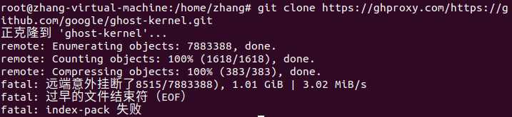</div>

​		**解决办法**:直接在GitHub上下载ghost-kernel代码，并执行指令`unzip ghost-kernel-ghost-v5.11.zip`进行解压

5. 编译安装ghOSt内核

   - 进入`ghost-kernel`,切换到root用户`sudo su`

   - make menuconfig，并save

     - 然后会在当前目录生成一个隐藏文件`.config`，对它进行如下修改：
       - 将`CONFIG_SYSTEM_TRUSTED_KEYS="debian/canonical-certs.pem"`修改为`CONFIG_SYSTEM_TRUSTED_KEYS=""` 
       - 添加`CONFIG_SCHED_CLASS_GHOST=y`

   - 编译：`make -j $(nproc)`

     - `$(nproc)`代表核心数，可以通过`echo $(nproc)`查看

     - 编译完成后，会生成vmlinux、modules*、ghost-kernel/arch/x86/boot/中会生成bzImage等

     - 运行指令`make -j $(nproc)`遇到报错：

<div align='center'>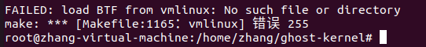</div>
        报错解决:只需要直接去 .config 配置文件中，将 CONFIG_DEBUG_INFO_BTF 的值，从 y 改为 n 即可解决！

   - make modules_install

     - 成功之后 /lib/modules中会有刚刚安装好的内核模块 `5.11.0+`

<div align='center'>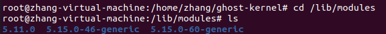</div>

   - 安装内核：make install

     - 该命令的作用是将.config，vmlinuz，initrd.img，System.map文件安装到*/boot/*目录

     - 成功之后/boot下会出现5.11.0+相关的文件

<div align='center'>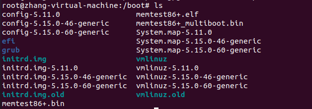</div>

   - 修改gurb

     - ubuntu20.04默认情况下，开机看不到grub界面，也就无法选择进入新编译好的内核。因此需要修改`/etc/default/grub`文件：
       - 将其中的“GRUB_TIMEOUT_STYLE=hidden”注释掉，以显示grub界面
       - GRUB_CMDLINE_LINUX_DEFAULT设置为text
       - 将GRUB_TIMEOUT修改成GRUB_TIMEOUT = 30
       - 修改完之后,update-grub更新一下grub

   - 重启之后，选择ghOSt的内核进行运行

     - 遇到了报错：

<div align='center'>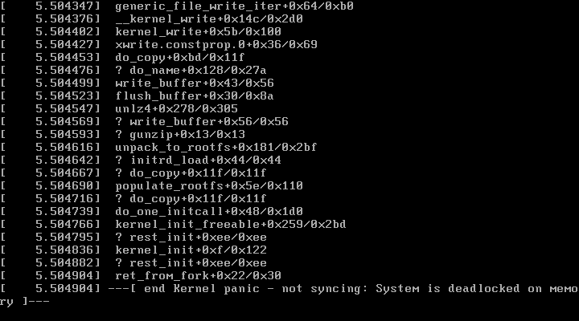</div>

       解决办法：发现是内存过小的问题，然后将内存调制4G

     - 编译成功：

<div align='center'>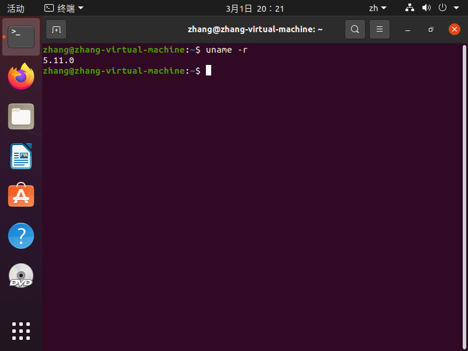</div>

6. 在 Ubuntu 上安装 Bazel：https://bazel.build/install/ubuntu?hl=zh-cn

   安装过程可能遇到报错：

<div align='center'>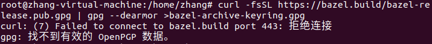</div>

   解决办法：

   打开浏览器，输入地址https://bazel.build/bazel-release.pub.gpg，手动下载文件，然后把它放在运行指令的目录下，执行指令：`gpg --dearmor < bazel-release.pub.gpg > bazel-archive-keyring.gpg`

7. 运行ghOSt测试

   执行如下指令，构建一个测试：

   ```
   bazel build -c opt agent_test
   ```

   会遇到如下报错：

<div align='center'>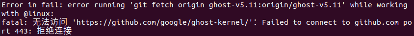</div>

   解决办法：

   执行如下指令取消全局代理：

   ```
   git config --global --unset http.proxy
   git config --global --unset https.proxy
   ```

   紧接着还会遇到报错：

<div align='center'>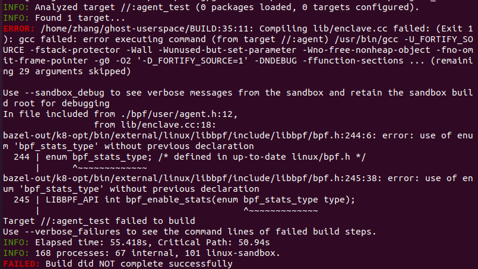</div>

   解决办法：

   该报错是由于头文件linux/bpf.h中没有定义枚举类型bpf_stats_type导致的，打开linux/bpf.h在其中定义：

   ```
   enum bpf_stats_type {
       BPF_STATS_RUN_TIME,
       BPF_STATS_RUN_CNT,
       BPF_STATS_RUN_ERR,
       BPF_STATS_RUN_DROP,
       BPF_STATS_RUN_BUSY,
       BPF_STATS_RUN_FILLED,
       BPF_STATS_RUN_TIME_AVG,
       BPF_STATS_RUN_TIME_MAX,
       BPF_STATS_RUN_QUEUE,
       BPF_STATS_RUN_WAIT_CNT,
       BPF_STATS_RUN_WAIT_TIME,
       BPF_STATS_RUN_MAP_MISS,
       BPF_STATS_RUN_BATCH_CNT,
       BPF_STATS_RUN_BATCH_MAX,
       BPF_STATS_RUN_BATCH_MISS,
       BPF_STATS_RUN_BATCH_ZERO,
       BPF_STATS_RUN_BATCH_SINGLE,
       BPF_STATS_RUN_BATCH_MULTI,
       BPF_STATS_RUN_LAST,
   };
   ```

   最后编译成功：

<div align='center'>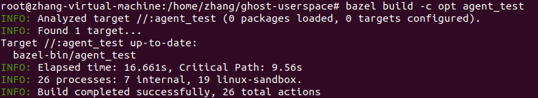</div>

   构建成功后，bazel-bin目录下就可以出现相应的可执行文件：

<div align='center'>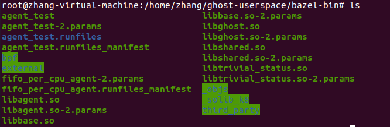</div>

   要运行测试，直接启动测试二进制文件:

   ```
   bazel-bin/agent_test
   ```

   运行结果：

<div align='center'></div>

8. 运行ghOSt调度器

   - 构建每cpu FIFO调度程序:

     ```
     bazel build -c opt fifo_per_cpu_agent
     ```

<div align='center'>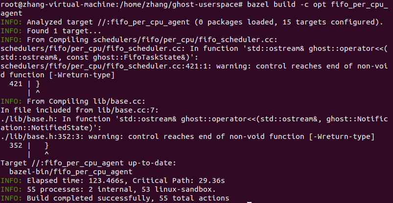</div>

   - 构建`simple_exp`，它会启动在ghOSt中运行的一系列pthread。`Simple_exp`是一个测试的集合。

     ```
     bazel build -c opt simple_exp
     ```

<div align='center'>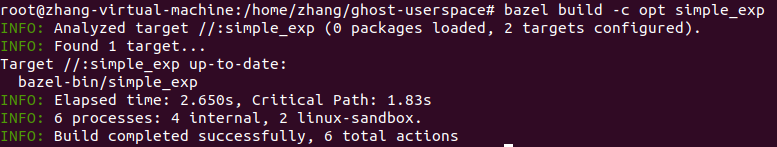</div>

   - 启动每cpu FIFO ghOSt调度器:

     ```
     bazel-bin/fifo_per_cpu_agent --ghost_cpus 0-1
     ```

     调度器在cpu(即逻辑内核)0和1上启动ghOSt代理，因此将ghOSt任务调度到cpu 0和1上。根据需要调整`——ghost_cpus`命令行参数值。例如，如果你有一台8核机器，你希望在所有核上调度ghOSt任务，那么将`0-7`传递给`——ghost_cpus`。

<div align='center'>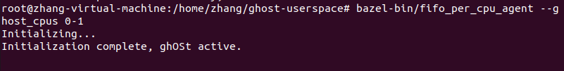</div>

   - 启动`simple_exp`:

     ```
     bazel-bin/simple_exp
     ```

     `Simple_exp`将启动pthread。这些pthread将依次移动到ghOSt调度类中，从而由ghOSt调度程序调度。当`simple_exp`运行完所有测试后，它将退出。

<div align='center'>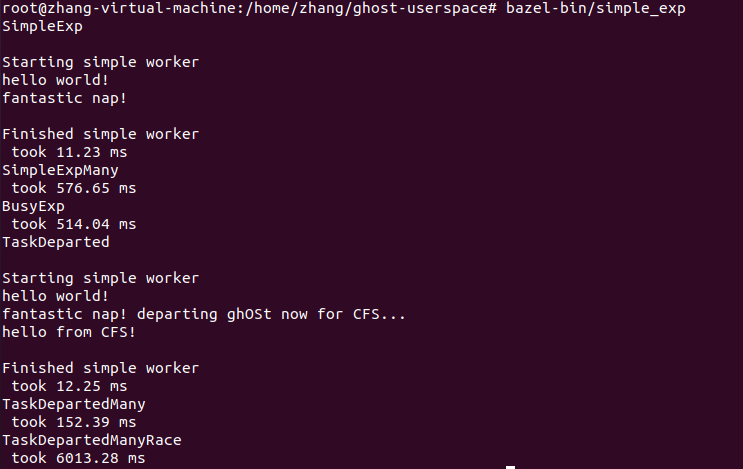</div>

   - 使用`Ctrl-C`向`fifo_per_cpu_agent`发送`SIGINT`信号以使其停止。

<div align='center'>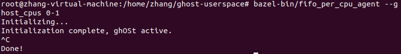</div>

9. 用户端运行ghOSt总结

   - 首先，构建调度策略代理（构建过的调度策略代理就不用再次构建了）：

     ```
     bazel build -c opt 调度策略代理
     ```

   - 启动ghOSt调度器：

     ```
     bazel-bin/调度策略代理 --ghost_cpus 0-n
     ```

     例：

     ```
     bazel-bin/fifo_per_cpu_agent --ghost_cpus 0-1
     ```

     调度器在cpu(即逻辑内核)0和1上启动ghOSt代理，因此将ghOSt任务调度到cpu 0和1上。根据需要调整`——ghost_cpus`命令行参数值。例如，如果你有一台8核机器，你希望在所有核上调度ghOSt任务，那么将`0-7`传递给`——ghost_cpus`。

   - 使用`Ctrl-C`向`调度策略代理`发送`SIGINT`信号以使其停止。

### （四）编译安装内核思路梳理

**大致流程：**

1. 若无.config文件，执行指令`make menuconfig`可以直接对后面生成的.config文件根据需求进行修改，然后save，或者直接save生成.config文件，根据需求对该文件的内容进行修改

2. 执行指令`make -j $(nproc)`对内核进行编译，$(nproc)代表核心数，可以通过echo $(nproc)查看，可能时间长一些

3. (可选) 编译内核模块，如果您需要编译内核模块（通常是驱动程序），则可以运行 `make modules`

4. (可选) 执行指令`make modules_install`安装内核模块，成功之后可在 /lib/modules中进行查看

5. 执行指令`make install`安装内核，成功之后可在/boot中进行查看

6. 修改gurb

   以ubuntu20.04为例，ubuntu20.04默认情况下，开机看不到grub界面，也就无法选择进入新编译好的内核。因此需要修改`/etc/default/grub`文件：

   - 将其中的“GRUB_TIMEOUT_STYLE=hidden”注释掉，以显示grub界面
   - GRUB_CMDLINE_LINUX_DEFAULT设置为text
   - 将GRUB_TIMEOUT修改成GRUB_TIMEOUT = 30
   - 修改完之后,update-grub更新一下grub

7. 执行指令reboot重启，选择Advanced options for Ubuntu，然后再选择自己编译安装好的系统

   例：

<div align='center'>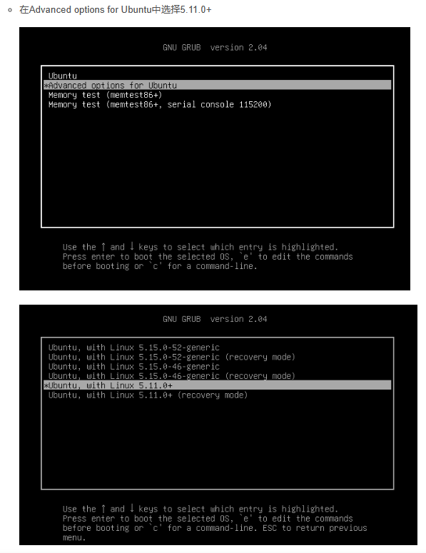</div>

8. 执行指令`uname -r`查看内核是否安装成功

**注意事项：**

1. 虚拟机核心数量尽可能大些（为了后期编译起来更加迅速），但尽量不要超过真机核数的一半
2. 虚拟机内存的大小根据情况也尽可能的大写，但尽量不要超过真机内存的一半
3. 虚拟机磁盘的大小根据安装内核的大小设置，尽可能大些
